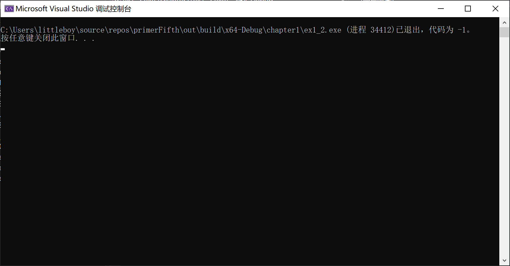
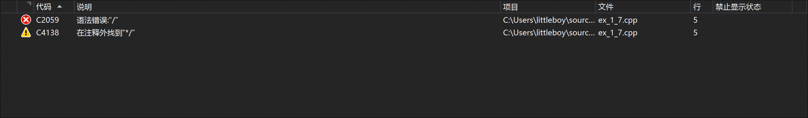
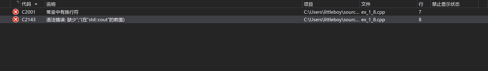
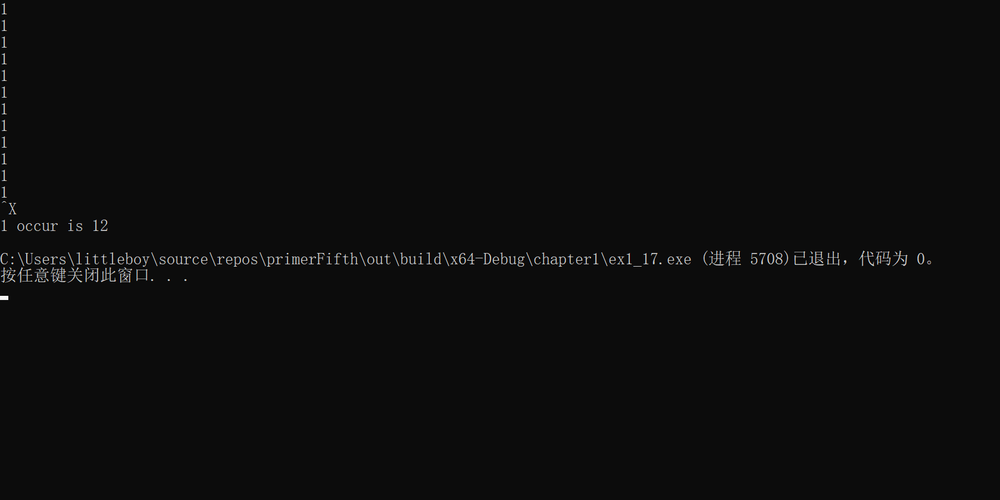
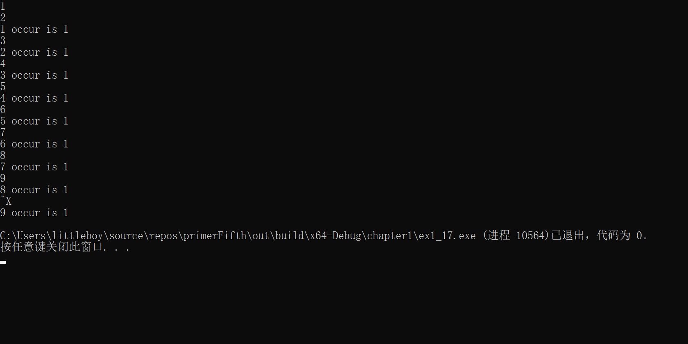
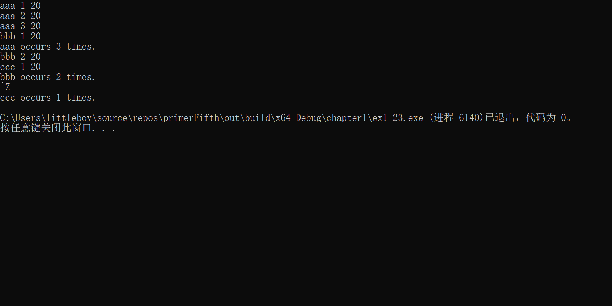

# 练习1.1

> 查阅你使用的编译器的文档, 确定它所使用的文件命名约定。编译并运行第2页的main程序。

# 练习1.2

> 改写程序, 让它返回-1。返回值-1通常被当作程序错误的标识。重新编译并运行你的程序, 观察你的系统如何处理main返回的错误标识。

```c++
int main()
{
    return -1;
}
```



# 练习1.3

> 编写程序, 在标准输出上打印Hello, world

```c++
int main()
{
	std::cout << "Hello, World" << std::endl;
}
```

# 练习1.4

> 编写程序使用乘法运算符*来打印两个数的积。

```c++
int main()
{
	int i = 0, j = 0;
	std::cin >> i >> j;
	std::cout << "product of " << i << " and " << j << " is " << i * j << std::endl;
}
```

# 练习1.5

> 我们将所有的输出操作放在一条很长的语句中。重写程序, 将每个运算对象的打印操作放到一条独立的语句中。

```c++
int main()
{
	std::cout << "enter two numbers";
	int i = 0, j = 0;
	std::cin >> i >> j;
	std::cout << "The product of ";
	std::cout << i;
	std::cout << " and ";
	std::cout << j;
	std::cout << " is ";
	std::cout << i * j;
	std::cout << std::endl;
	return 0;
}
```

# 练习1.6

> 解释下列片段是否合法。

不合法。因为第一条语句使用分号结尾, 而第二条和第三条语句开头的`<<`运算符没有任何可以操作的对象。有两种方案, 第一种:

```c++
std::cout << "The sum of " << v1
		<< " and " << v2
		<< " is " v1 + v2 << std::endl;
```

第二种:

```c++
std::cout << "The sum of " << v1;
std::cout << " and " << v2;
std::cout << " is " v1 + v2 << std::endl;
```

# 练习1.7

> 编译一个包含不正确的嵌套注释的程序, 观察编译器返回的错误信息。

```c++
int main()
{
	/*
	/*注释不能被嵌套*/
	*/
	return 0;
}
```



# 练习1.8

指出下列哪些语句是合法的:

```c++
std::cout << "/*"; // 合法
std::cout << "*/"; // 合法
std::cout << /* "*/" */; // 不合法
std::cout << /* "*/" /* "/*" */; // 合法
```

改正编译错误。



只需要在第三条语句最后加一个引号`"`就可以。

```c++
std::cout << "/*";
std::cout << "*/";
std::cout << /* "*/" */";
std::cout << /* "*/" /* "/*" */;
```

# 练习1.9

> 编写程序, 使用while循环将50到100的数相加。

# 练习1.10

> 使用递减运算符在循环中按递减顺序打印10到0之间的整数。

# 练习1.11

> 编写程序, 提示用户输入两个整数, 打印这两个整数所指定范围内的所有整数。

# 练习1.12

> 下面的for循环完成了什么功能? sum的终值是多少?

```c++
int sum = 0;
for (int i = -100; i <= 100; ++i)
	sum += i;
```

完成了从-100到100所有数之和, sum终值为0

# 练习1.13

> 使用for循环重做1.4.1节中所有的练习。

# 练习1.14

> 对比for循环和while循环, 两种形式的优缺点是什么?

for循环:
可以同时有条件检测, 声明变量和变量改变
优点:
当需要声明变量并改变变量时, 语法简洁
缺点:
当只需要条件检测时, 和while循环比语法��嗦

while循环:
while只有条件检测

# 练习1.15

> 编写程序, 包含"再探编译"中讨论的常见错误, 熟悉编译器生成的错误信息

```c++
// syntax error
int main()
{
	// error, endl后面使用了冒号而非分号
	std::cout << "Read each file." << std::endl:
	std::cout << Update master. << std::endl;
}

// type error
int a = "";

// declaraction error
#include <iostream>
int main()
{
	// cout 未定义
	cout << "Hello, world" << std::endl;
}

```

# 练习1.16

> 编写程序, 从cin读取一组数, 输出其和

# 练习1.17

> 如果输入所有值都相等, 本节的程序会输出什么? 如果没有重复的值, 输出又会是怎样的?





# 练习1.18

> 编译并运行本节的程序, 给它输入全部相等的值。再次运行程序, 输入没有重复的值

# 练习1.19

> 修改你为1.4.1节练习1.10所编写的程序, 使其能处理用户输入的第一个数比第二个数小的情况。

在处理之前先进行if判断(可以看`ex_1_11.cpp`)

# 练习1.20

> 将Sales_item.h拷贝到自己的工作目录中, 用它编写一个程序, 读取一组销售记录, 将每条销售记录打印到标准输出上。

# 练习1.21

> 编写程序, 读取两个ISBN相同的Sales_item对象, 输出它们的和。

# 练习1.22

> 编写程序, 读取具有多个相同ISBN的销售记录, 输出所有记录的和。

# 练习1.23

> 编写程序, 读取多条销售记录, 并统计每个ISBN有几本销售记录。

# 练习1.24

> 输入表示多个ISBN的多条销售记录来测试上一个程序, 每个ISBN的记录应该聚集在一起。



# 练习1.25

> 编译并运行本节给出的书店程序。

参考ex_1_22.cpp
